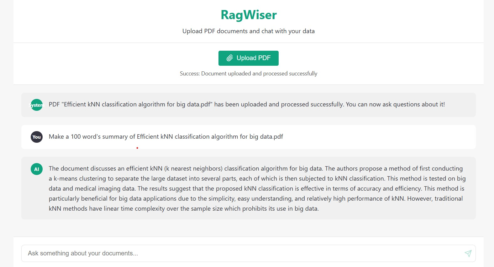

# RagWiser

RagWiser is a Retrieval Augmented Generation (RAG) system built with Spring Boot that enables users to upload PDF documents, process them, and ask questions about their content using natural language.

## Project Overview

RagWiser uses Spring AI and PGVector to create an advanced document question-answering system. It processes PDF documents, stores their vectorized representation in a PostgreSQL database with pgvector extension, and answers user queries by retrieving relevant context and generating responses using OpenAI's GPT models.

## Features

- **PDF Document Upload**: Upload and process PDF documents through a REST API
- **Document Vectorization**: Automatically extracts text from PDFs, splits it into chunks, and stores embeddings
- **Semantic Search**: Query documents using natural language
- **RAG-powered Response Generation**: Get accurate answers based on the content of your documents
- **Spring AI Integration**: Leverages Spring AI for vector stores and LLM integration
- **Docker Support**: Containerized PostgreSQL with pgvector extension

## UI 
RagWiser uses React for its user interface, providing a simple and intuitive way to interact with the RAG system. The UI allows users to upload PDF documents, ask questions, and view answers in a user-friendly manner.




## Technology Stack

- **Java 21**
- **Spring Boot 3.3.2**
- **Spring AI 1.0.0-M1**
- **PostgreSQL with pgvector extension**
- **Docker**
- **OpenAI GPT-4**

## Getting Started

### Prerequisites

- Java Development Kit (JDK) 21
- Docker and Docker Compose
- OpenAI API Key

### Setup and Installation

1. Clone the repository:
   ```bash
   git clone https://github.com/RobertoDure/RagWiser.git
   cd RagWiser
   ```

2. Configure your OpenAI API key in `src/main/resources/application.yaml`:
   ```yaml
   spring:
     ai:
       openai:
         api-key: YOUR_OPENAI_API_KEY
   ```

3. Start the PostgreSQL database with pgvector:
   ```bash
   docker-compose up -d
   ```

4. Build and run the application:
   ```bash
   ./mvnw spring-boot:run
   ```

### API Endpoints

#### Upload a PDF Document
```
POST /api/rag/upload
Content-Type: multipart/form-data
```
Parameters:
- `file`: PDF file (required)

#### Ask a Question
```
GET /api/rag?question=YOUR_QUESTION_HERE
```
Parameters:
- `question`: The question to be answered (default: "List all the Articles in the Irish Constitution")

## How It Works

1. **Document Processing**:
   - PDF documents are uploaded via the `/api/rag/upload` endpoint
   - The application uses `PagePdfDocumentReader` to extract text from PDFs
   - Text is split into chunks using `TokenTextSplitter`
   - Text chunks are embedded and stored in the vector database

2. **Question Answering**:
   - User submits a question via the `/api/question` endpoint
   - The system retrieves the most relevant document chunks using vector similarity search
   - A prompt template combines the question and retrieved documents
   - OpenAI's GPT model generates an answer based on the context

3. **MCP Integration**:
   - The application also provides a Tool-based integration for RAG capabilities using Spring AI's Tool Callbacks
   - This enables the RAG functionality to be used as a tool by other AI systems

## Database Schema

The application uses a PostgreSQL database with the pgvector extension for storing document embeddings:

```sql
CREATE TABLE vector_store (
    id uuid DEFAULT uuid_generate_v4() PRIMARY KEY,
    content text,
    metadata json,
    embedding vector(1536)
);

CREATE INDEX ON vector_store USING HNSW (embedding vector_cosine_ops);
```

## Configuration

Key configuration options in `application.yaml`:

```yaml
spring:
  datasource:
    url: jdbc:postgresql://localhost:5432/rag_db
    username: postgres
    password: postgres
  ai:
    openai:
      api-key: YOUR_OPENAI_API_KEY
      chat:
        options:
          model: gpt-4
  vectorstore:
    pgvector:
      index-type: HNSW
      distance-type: COSINE_DISTANCE
      dimensions: 1536
  servlet:
    multipart:
      enabled: true
      max-file-size: 100MB
      max-request-size: 100MB
```

## Contributing

Contributions are welcome! Please feel free to submit a Pull Request.

## License

This project is licensed under the MIT License. See the [LICENSE](LICENSE) file for details.

## Acknowledgements

- Spring AI Team for their excellent framework
- PostgreSQL and pgvector for vector storage capabilities
- OpenAI for their powerful language models

